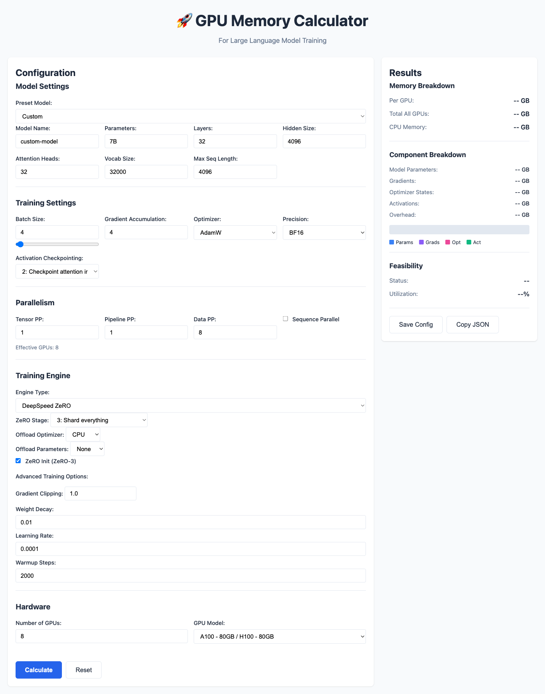

# GPU Memory Calculator for LLM Training

A versatile Python application for calculating GPU memory requirements for training Large Language Models with support for multiple training engines including PyTorch DDP, DeepSpeed ZeRO, Megatron-LM, and FSDP.

<p align="center">
  
</p>

## Features

### Core Capabilities
- **Multiple Training Engines**: Support for PyTorch DDP, DeepSpeed ZeRO (stages 0-3), Megatron-LM, Megatron+DeepSpeed, and PyTorch FSDP
- **Dual Interface**: Both CLI and Web UI for flexible usage
- **Preset Models**: Quick-load configurations for popular models (LLaMA 2, GPT-3, GLM, Mixtral, etc.)
- **Detailed Breakdown**: Memory breakdown by component (parameters, gradients, optimizer states, activations)
- **Feasibility Analysis**: Check if your configuration fits on available GPU memory
- **Easy Config**: JSON-based configuration files with human-readable parameter formats (e.g., "7B", "7000M")

### Web UI Enhancements
- **Formula Explanations**: See exactly how memory is calculated with your values plugged in
- **Real-time Validation**: Client-side validation prevents invalid configurations
- **Smart Auto-calculation**: Optimized debouncing (1s) with minimum interval protection
- **Export Capabilities**: Export to DeepSpeed config files, JSON, or copy to clipboard
- **Batch Size Optimizer**: Automatically find maximum batch size that fits
- **Comparison Mode**: Save and compare different configurations side-by-side
- **Accessibility Features**: ARIA labels, keyboard navigation, colorblind-friendly charts

### Advanced Features
- **MoE Support**: Mixture of Experts models with configurable experts and top-k routing
- **CPU/NVMe Offloading**: Offload optimizer states and parameters to CPU or NVMe storage
- **Activation Checkpointing**: 5 levels from none to full checkpointing
- **Sequence Parallelism**: Optimize memory for long sequences
- **Result Caching**: Fast repeated calculations with built-in caching

## Installation

### From source

```bash
git clone https://github.com/George614/gpu-mem_calculator.git
cd gpu_mem_calculator
pip install -e .
```

### For Web UI support

```bash
pip install -e ".[web]"
```

### Development installation

```bash
pip install -e ".[dev]"
```

## Usage

### Command Line Interface

#### Using model presets (Recommended)

The calculator includes pre-configured model presets for popular LLMs:

```bash
# List all available presets
gpu-mem-calc presets

# Calculate with a preset
gpu-mem-calc calculate --preset llama2-7b
gpu-mem-calc calculate --preset mixtral-8x7b --format json

# List presets in table format
gpu-mem-calc presets --format table
```

Available presets include:
- **Dense Models**: LLaMA 2 (7B, 13B, 70B), GPT-3 (175B)
- **MoE Models**: Mixtral 8x7B, GLM-4 (9B), GLM-4.7 (355B), GLM-4.5 Air (106B),
  Qwen1.5-MoE-A2.7B, DeepSeek-MoE (16B)

#### Calculate from config file

```bash
gpu-mem-calc calculate --config configs/llama2_7b_deepspeed.json
```

#### Quick calculation from model size

```bash
# Calculate memory for 7B model with 8x80GB GPUs using DeepSpeed
gpu-mem-calc quick 7 --gpus 8 --engine deepspeed

# With custom GPU memory
gpu-mem-calc quick 70 --gpus 64 --gpu-mem 80 --engine megatron
```

#### Validate configuration

```bash
gpu-mem-calc validate configs/my_config.json
```

### Web Interface

Start the web server:

```bash
python -m gpu_mem_calculator.web.app
```

Or using uvicorn directly:

```bash
uvicorn gpu_mem_calculator.web.app:app --reload
```

Then open your browser to `http://localhost:8000`

### Python API

```python
from gpu_mem_calculator.core.calculator import GPUMemoryCalculator
from gpu_mem_calculator.core.models import (
    ModelConfig,
    TrainingConfig,
    ParallelismConfig,
    EngineConfig,
    GPUConfig,
)

# Create configuration
model_config = ModelConfig(
    name="llama2-7b",
    num_parameters=7_000_000_000,
    num_layers=32,
    hidden_size=4096,
    num_attention_heads=32,
    vocab_size=32000,
    max_seq_len=4096,
)

training_config = TrainingConfig(
    batch_size=4,
    gradient_accumulation_steps=4,
    dtype="bf16",
    optimizer="adamw",
)

parallelism_config = ParallelismConfig(
    data_parallel_size=8,
)

engine_config = EngineConfig(
    type="deepspeed",
    zero_stage=3,
    offload_optimizer="cpu",
)

gpu_config = GPUConfig(
    num_gpus=8,
    gpu_memory_gb=80,
)

# Calculate memory
calculator = GPUMemoryCalculator(
    model_config=model_config,
    training_config=training_config,
    parallelism_config=parallelism_config,
    engine_config=engine_config,
    gpu_config=gpu_config,
)

result = calculator.calculate()

print(f"Memory per GPU: {result.total_memory_per_gpu_gb:.2f} GB")
print(f"Fits on GPU: {result.fits_on_gpu}")
print(f"Utilization: {result.memory_utilization_percent:.1f}%")
```

## Configuration File Format

```json
{
  "model": {
    "name": "llama2-7b",
    "num_parameters": "7B",
    "num_layers": 32,
    "hidden_size": 4096,
    "num_attention_heads": 32,
    "vocab_size": 32000,
    "max_seq_len": 4096
  },
  "training": {
    "batch_size": 4,
    "gradient_accumulation_steps": 4,
    "optimizer": "adamw",
    "dtype": "bf16",
    "activation_checkpointing": 1
  },
  "parallelism": {
    "tensor_parallel_size": 1,
    "pipeline_parallel_size": 1,
    "data_parallel_size": 8,
    "sequence_parallel": false
  },
  "engine": {
    "type": "deepspeed",
    "zero_stage": 3,
    "offload_optimizer": "cpu",
    "offload_param": "none"
  },
  "hardware": {
    "num_gpus": 8,
    "gpu_memory_gb": 80
  }
}
```

## Supported Training Engines

### PyTorch DDP (Baseline)
Standard Distributed Data Parallel training without memory optimizations.

### DeepSpeed ZeRO
- **ZeRO-1**: Shard optimizer states
- **ZeRO-2**: Shard optimizer states + gradients
- **ZeRO-3**: Shard everything (parameters, gradients, optimizer states)
- Supports CPU/NVMe offloading

### Megatron-LM
Tensor and pipeline parallelism with activation checkpointing support.

### Megatron + DeepSpeed
Combines Megatron-LM's model parallelism with DeepSpeed ZeRO's optimizer sharding.

### PyTorch FSDP
Fully Sharded Data Parallel with multiple sharding strategies.

## Memory Formulas

The calculator uses formulas verified against authoritative sources:

### Base Components

**Model Parameters:**
- FP16/BF16: `num_params × 2 bytes`
- FP32: `num_params × 4 bytes`

**Gradients:**
- FP16/BF16: `num_params × 2 bytes`
- FP32: `num_params × 4 bytes`

**Optimizer States** (per optimizer type):
- **Adam/AdamW**: `num_params × 12 bytes`
  - 4 bytes: FP32 parameter copy
  - 4 bytes: Momentum
  - 4 bytes: Variance
- **AdamW 8-bit**: `num_params × 2 bytes` (quantized)
- **SGD**: `num_params × 4 bytes` (FP32 only, no momentum)

**Activations:**
- Approximation: `batch_size × seq_len × hidden_size × num_layers × ~16 bytes/token/layer`
- Varies based on activation checkpointing level

### DeepSpeed ZeRO Stages

**ZeRO-0** (Baseline - same as PyTorch DDP):
```
total_per_gpu = 2×params + 2×params + 12×params + activations
             = 16×params + activations
```

**ZeRO-1** (Shard optimizer states):
```
total_per_gpu = 2×params + 2×params + (12×params)/num_gpus + activations
```

**ZeRO-2** (Shard optimizer + gradients):
```
total_per_gpu = 2×params + (2×params)/num_gpus + (12×params)/num_gpus + activations
```

**ZeRO-3** (Shard everything):
```
total_per_gpu = largest_layer_memory + (16×params)/num_gpus + activations
where largest_layer_memory ≈ 4×(num_params/10)
```

**CPU/NVMe Offloading:**
- Optimizer states offloaded to CPU: 0 GB GPU memory
- Parameters offloaded to CPU/NVMe: Dynamically gathered during compute

### Verification

All formulas have been verified against:
- ✅ 18 comprehensive test scenarios (100% pass rate)
- ✅ EleutherAI Transformer Math 101
- ✅ Microsoft Research ZeRO Blog
- ✅ DeepSpeed Official Documentation
- ✅ PyTorch FSDP Documentation

### References

- [EleutherAI Transformer Math 101](https://blog.eleuther.ai/transformer-math/) - Comprehensive transformer memory breakdown
- [Microsoft Research ZeRO Blog](https://www.microsoft.com/en-us/research/blog/zero-deepspeed-new-system-optimizations-enable-training-models-with-over-100-billion-parameters/) - ZeRO optimization techniques
- [DeepSpeed Memory Documentation](https://deepspeed.readthedocs.io/en/latest/memory.html) - Official DeepSpeed memory formulas

## Example Configurations

### LLaMA 2 7B with DeepSpeed ZeRO-3
```bash
gpu-mem-calc calculate --config configs/llama2_7b_deepspeed.json
```

### GPT-3 175B with Megatron-LM
```bash
gpu-mem-calc calculate --config configs/gpt3_175b_megatron.json
```

### Custom 1B model with PyTorch DDP
```bash
gpu-mem-calc calculate --config configs/pytorch_ddp_example.json
```

## Web UI Features

### Interactive Interface
- **Real-time Calculations**: Auto-calculates as you adjust parameters (1s debounce)
- **Client-side Validation**: Instant feedback on configuration errors before API calls
- **Smart Presets**: Quick-load model configurations (LLaMA 2, GPT-3, GLM, Mixtral, Qwen, DeepSeek)
- **Visual Breakdown**: Color-coded bar chart with patterns for colorblind accessibility
- **Feasibility Status**: Clear indicators showing if configuration fits on GPU

### Formula Explanations
- **Detailed Breakdowns**: See exact formulas used with your values plugged in
- **Component-by-Component**: Each memory component explained with formula and result
- **Authoritative References**: Links to EleutherAI, Microsoft Research, DeepSpeed docs
- **Engine-Specific Details**: Different formulas for PyTorch DDP, DeepSpeed ZeRO, FSDP, Megatron-LM

### Advanced Tools
- **Export to DeepSpeed**: Generate `deepspeed_config.json` files automatically
- **Batch Size Optimizer**: Find maximum batch size that fits your GPU memory
- **Config Persistence**: Save configurations to browser localStorage
- **Comparison Mode**: Compare different configurations side-by-side

### Accessibility
- **ARIA Labels**: Full screen reader support throughout the interface
- **Keyboard Navigation**: All features accessible via keyboard
- **Colorblind-Friendly**: Patterns and textures supplement colors in charts
- **High Contrast**: Clear visual indicators with multiple cues

### API Endpoints
- `POST /api/calculate` - Calculate GPU memory requirements
- `POST /api/explain-formula` - Get detailed formula explanation
- `POST /api/export/deepspeed` - Export DeepSpeed config file
- `POST /api/optimize/batch-size` - Find maximum batch size
- `GET /api/preset/{preset_name}` - Load model preset

## Development

### Running Tests

```bash
pytest tests/
```

### Test Coverage

The calculator includes comprehensive testing:
- **Unit Tests**: Core calculation logic for each engine type
- **Integration Tests**: End-to-end configuration validation
- **Formula Verification**: 18 scenarios verifying formula accuracy
- **API Tests**: Web API endpoint testing
- **Accessibility Tests**: Screen reader and keyboard navigation

All formulas verified accurate against authoritative sources with 100% test pass rate.

### Code Formatting

```bash
black src/ cli/ web/
ruff check src/ cli/ web/
```

### Type Checking

```bash
mypy src/
```

## Recent Improvements

### Latest Updates
- ✨ Added formula explanation feature with detailed breakdowns
- ✨ Added client-side validation for better UX
- ✨ Added batch size optimizer API
- ✨ Added DeepSpeed config export functionality
- ✨ Added comprehensive input validation
- ✨ Added result caching for performance
- ♿ Added ARIA labels for full accessibility
- ♿ Added colorblind patterns to charts
- 🐛 Fixed optimizer formulas to be optimizer-specific
- 🐛 Fixed Pydantic namespace warnings

### Verification Status
- ✅ All 18 test scenarios passing (100%)
- ✅ Formulas verified against EleutherAI, Microsoft Research, DeepSpeed docs
- ✅ Optimizer formulas corrected for AdamW, AdamW 8-bit, and SGD
- ✅ ZeRO stage formulas validated (0, 1, 2, 3)
- ✅ Engine type formulas validated (PyTorch DDP, DeepSpeed, FSDP, Megatron-LM)

## Contributing

Contributions are welcome! Please feel free to submit a Pull Request.

## References

The memory calculations in this tool are based on authoritative sources:

**Core Memory Formulas:**
- [EleutherAI Transformer Math 101](https://blog.eleuther.ai/transformer-math/) - Comprehensive breakdown of transformer memory requirements
- [Microsoft Research ZeRO Blog](https://www.microsoft.com/en-us/research/blog/zero-deepspeed-new-system-optimizations-enable-training-models-with-over-100-billion-parameters/) - ZeRO optimization techniques
- [Reducing Activation Recomputation in Large Transformer Models](https://arxiv.org/abs/2204.13323) - Activation checkpointing strategies

**Engine Documentation:**
- [DeepSpeed Memory Documentation](https://deepspeed.readthedocs.io/en/latest/memory.html) - Official DeepSpeed memory formulas
- [NVIDIA Megatron-LM](https://github.com/NVIDIA/Megatron-LM) - Tensor and pipeline parallelism
- [PyTorch FSDP Documentation](https://pytorch.org/docs/stable/fsdp.html) - Fully sharded data parallel
- [PyTorch DDP Tutorial](https://pytorch.org/tutorials/intermediate/ddp_tutorial.html) - Distributed data parallel

**Related Tools:**
- [llm-analysis](https://github.com/cli99/llm-analysis) - LLM memory analysis
- [vram-calculator](https://github.com/furiousteabag/vram-calculator) - VRAM calculation utilities

## License

MIT License

## Acknowledgments

This tool was inspired by and builds upon the excellent work of:
- [DeepSpeed Memory Estimator](https://deepspeed.readthedocs.io/en/latest/memory.html) - ZeRO memory optimization formulas
- [llm-analysis](https://github.com/cli99/llm-analysis) - LLM memory analysis methodology
- [vram-calculator](https://github.com/furiousteabag/vram-calculator) - VRAM calculation approach

Special thanks to the EleutherAI community for their comprehensive [Transformer Math 101](https://blog.eleuther.ai/transformer-math/) guide, which provides detailed formulas for transformer memory calculations.
